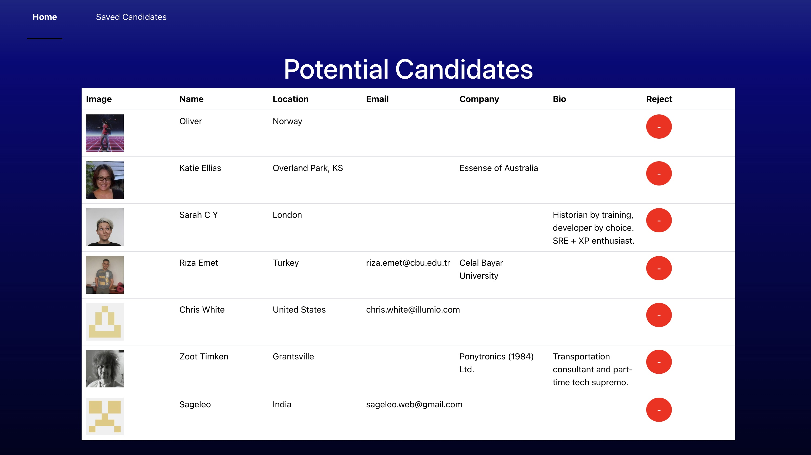

# Candidate Search

## Description

This application helps to search for potential candidates for a company. Is reviewing a selection of profiles coming from GitHub where the whoever is using the app is able to reject or save the users.

## Usage

Deployed: https://candidate-search-s61w.onrender.com

The Homescreen shows the different properties of each candidate and there is the option of Reject or Save by using the buttons.

On the table, all the saved potential candidates are being displayed, having a different view of the properties. Also there is the option of Reject on the right side of the table by using the button.

## Question

GitHub: [Nattan Aguia Trujillo](https://github.com/nattanaguiat)

If you have additional questions, please contact me by email at [nattan23@msn.com](nattan23@msn.com)

